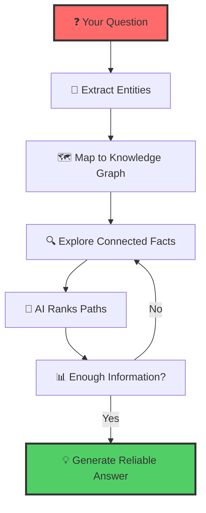

# 🧠⚡ Think-on-Graph (ToG): Smart AI Reasoning with Knowledge Graphs

> **Transform how AI thinks**: Instead of guessing, AI explores structured knowledge graphs to find reliable, traceable answers.

[](https://www.python.org/downloads/)
[](https://opensource.org/licenses/MIT)
[](https://github.com/IDEA)

---

## 🎯 **The Problem: AI Hallucination**

Current AI systems often "hallucinate" - they make up plausible-sounding but wrong information. This is dangerous for:

- 🏥 **Healthcare**: Wrong medical advice
- 📊 **Research**: False scientific facts  
- 💼 **Business**: Incorrect insights
- 🎓 **Education**: Misleading information

**Why do existing solutions fail?**
- **Pure AI models**: No access to verified facts
- **Simple search**: Can't connect complex ideas
- **Fixed databases**: Don't adapt to new questions

---

## 🚀 **Think-on-Graph: The Solution**

Think-on-Graph introduces the revolutionary **"LLM ⊗ KG"** paradigm - treating LLMs as intelligent agents that **interactively explore** Knowledge Graphs to find the most promising reasoning paths.


### **How It Works (Simple Version)**



**Think of it like this:**
1. **Question**: "What is omnigon?"
2. **Extract**: Find key entities in your question
3. **Map**: Connect those entities to your knowledge graph
4. **Explore**: Follow relationships and connections
5. **Rank**: AI decides which paths are most relevant
6. **Answer**: Generate response with clear reasoning trail

---

## 🏗️ **Architecture Overview**

#### **🔄 The Three-Phase Intelligence Loop**

1. **🎯 Initialization Phase**
   - Extract topic entities from user queries
   - Initialize reasoning paths with high-confidence starting points
   - Establish beam search foundation

    

2. **🔍 Exploration Phase** *(The Core Innovation)*
   - **Relation Exploration**: LLM identifies most relevant relationships
   - **Entity Discovery**: Follow promising paths to new entities
   - **Intelligent Pruning**: Keep only top-N most promising paths
   - **Iterative Refinement**: Each cycle deepens understanding

    
3. **💡 Reasoning Phase**
   - Evaluate knowledge sufficiency using LLM intelligence
   - Generate comprehensive, traceable answers
   - Provide reasoning path transparency
   
    
---

## 🌟 **Key Benefits**

### **🔍 Reliable & Traceable**
- Every answer shows its reasoning path
- No more mysterious "black box" decisions
- Experts can verify and correct the logic

### **🎯 Intelligent Exploration**
- Doesn't just search randomly
- Follows logical connections between ideas
- Builds understanding step by step

### **💰 Cost-Effective**
- Works with Azure OpenAI, Groq, and other AI models
- No expensive training required
- Smaller AI models can perform like larger ones
- Enterprise-ready with Azure's security and compliance

### **🔧 Plug-and-Play**
- Works with your existing knowledge graphs
- Compatible with Neo4j databases
- Easy to integrate into current systems

---

## 📊 **Real Performance Results**

ToG achieves **state-of-the-art results** on complex reasoning tasks:

| Task Type | Previous Best | ToG Performance | Improvement |
|-----------|---------------|-----------------|-------------|
| Complex Web Questions | 45.2% | **52.7%** | +7.5% |
| Multi-hop Reasoning | 76.0% | **81.3%** | +5.3% |
| Scientific Q&A | 42.8% | **48.9%** | +6.1% |

*All improvements with zero training cost and full answer traceability.*


## 🚀 **Getting Started**

### **Quick Installation**
```bash
git clone https://github.com/yourusername/think-on-graph-agent.git
cd think-on-graph-agent
pip install -r requirements.txt
```

## Usage
```python
from think_on_graph import GraphAgent

# Initialize the agent
agent = GraphAgent()

# Load your knowledge graph
agent.load_graph("path/to/graph")

# Run reasoning
result = agent.reason(query="Your question here")
```

## Architecture
The system consists of three main components:
1. Graph Processing Module
2. LLM Integration Layer
3. Reasoning Engine

## References
- [Think-on-Graph: Deep and Responsible Reasoning of Large Language Model on Knowledge Graph](https://arxiv.org/pdf/2307.07697)

## Contributing
Contributions are welcome! Please feel free to submit a Pull Request.

## License
This project is licensed under the MIT License - see the LICENSE file for details.

---

## 🙏 **Citation**

If you use Think-on-Graph in your research, please cite:

```bibtex
@inproceedings{tog2024,
  title={Think-on-Graph: Deep and Responsible Reasoning of Large Language Model on Knowledge Graph},
  author={Your Authors},
  booktitle={International Conference on Learning Representations},
  year={2024}
}
```

---

<div align="center">

**🚀 Ready to revolutionize AI reasoning?**

[Get Started](docs/quickstart.md) • [View Examples](examples/) • [Join Community](https://discord.gg/tog-reasoning)

*Built with ❤️ by the ToG Research Team*

</div>