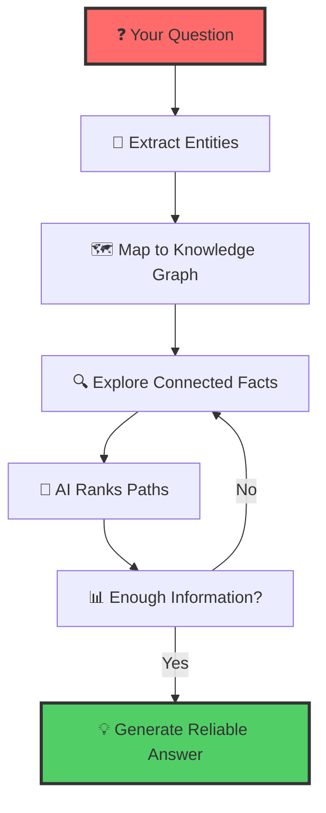
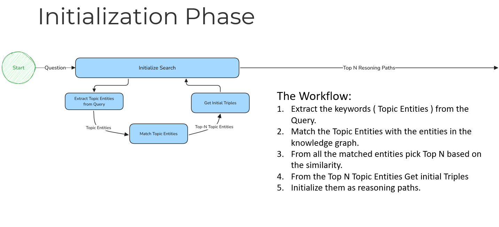
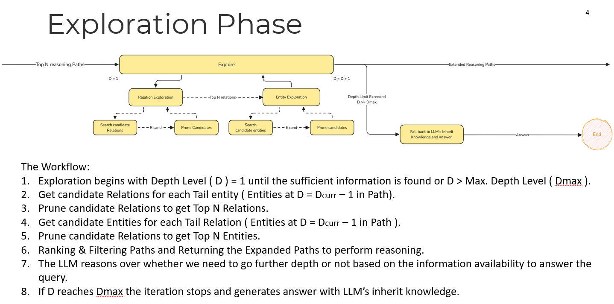
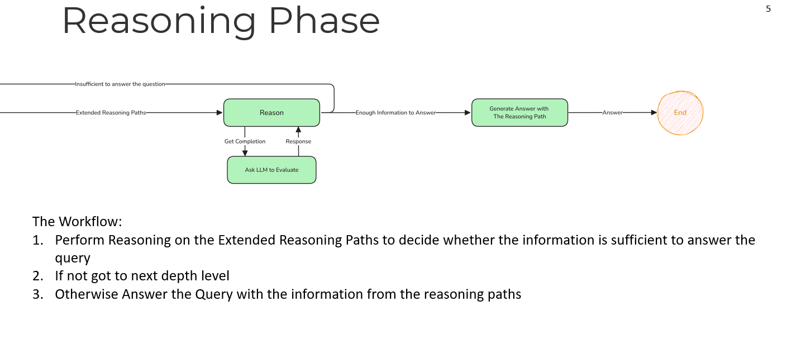

# 🧠⚡ Think-on-Graph (ToG): Smart AI Reasoning with Knowledge Graphs

> **Transform how AI thinks**: Instead of guessing, AI explores structured knowledge graphs to find reliable, traceable answers.

[](https://www.python.org/downloads/)
[](https://opensource.org/licenses/MIT)
[](https://github.com/IDEA)

---

## 🎯 **The Problem: AI Hallucination**

Current AI systems often "hallucinate" - they make up plausible-sounding but wrong information. This is dangerous for:

- 🏥 **Healthcare**: Wrong medical advice
- 📊 **Research**: False scientific facts  
- 💼 **Business**: Incorrect insights
- 🎓 **Education**: Misleading information

**Why do existing solutions fail?**
- **Pure AI models**: No access to verified facts
- **Simple search**: Can't connect complex ideas
- **Fixed databases**: Don't adapt to new questions

---

## 🚀 **Think-on-Graph: The Solution**

Think-on-Graph introduces the revolutionary **"LLM ⊗ KG"** paradigm - treating LLMs as intelligent agents that **interactively explore** Knowledge Graphs to find the most promising reasoning paths.


### **How It Works (Simple Version)**



**Think of it like this:**
1. **Question**: "What is omnigon?"
2. **Extract**: Find key entities in your question
3. **Map**: Connect those entities to your knowledge graph
4. **Explore**: Follow relationships and connections
5. **Rank**: AI decides which paths are most relevant
6. **Answer**: Generate response with clear reasoning trail

---

## 🏗️ **Architecture Overview**

#### **🔄 The Three-Phase Intelligence Loop**

1. **🎯 Initialization Phase**
   - Extract topic entities from user queries
   - Initialize reasoning paths with high-confidence starting points
   - Establish beam search foundation

    

2. **🔍 Exploration Phase** *(The Core Innovation)*
   - **Relation Exploration**: LLM identifies most relevant relationships
   - **Entity Discovery**: Follow promising paths to new entities
   - **Intelligent Pruning**: Keep only top-N most promising paths
   - **Iterative Refinement**: Each cycle deepens understanding

    
3. **💡 Reasoning Phase**
   - Evaluate knowledge sufficiency using LLM intelligence
   - Generate comprehensive, traceable answers
   - Provide reasoning path transparency
   
    
---

## 🌟 **Key Benefits**

### **🔍 Reliable & Traceable**
- Every answer shows its reasoning path
- No more mysterious "black box" decisions
- Experts can verify and correct the logic

### **🎯 Intelligent Exploration**
- Doesn't just search randomly
- Follows logical connections between ideas
- Builds understanding step by step

### **💰 Cost-Effective**
- Works with Azure OpenAI, Groq, and other AI models
- No expensive training required
- Smaller AI models can perform like larger ones
- Enterprise-ready with Azure's security and compliance

### **🔧 Plug-and-Play**
- Works with your existing knowledge graphs
- Compatible with Neo4j databases
- Easy to integrate into current systems

---

## 📊 **Real Performance Results**

ToG achieves **state-of-the-art results** on complex reasoning tasks:

| Task Type | Previous Best | ToG Performance | Improvement |
|-----------|---------------|-----------------|-------------|
| Complex Web Questions | 45.2% | **52.7%** | +7.5% |
| Multi-hop Reasoning | 76.0% | **81.3%** | +5.3% |
| Scientific Q&A | 42.8% | **48.9%** | +6.1% |

*All improvements with zero training cost and full answer traceability.*


## 🚀 **Getting Started**

### **Quick Installation**
```bash
pip install tog-reasoning
```

### **Basic Usage**

```python
from tog import ToG
from tog.llms.azure_openai_llm import AzureOpenAILLM
from tog.kgs.neo4j_kg import Neo4jKnowledgeGraph

# Set up your Azure OpenAI and knowledge graph
llm = AzureOpenAILLM(model_name="gpt-4o")
kg = Neo4jKnowledgeGraph()

# Create the ToG explorer
explorer = ToG(llm=llm, kg=kg)

# Ask questions and get traced answers
query = "What is omnigon?"
result = explorer.explore_and_answer(query)

# Get your answer with reasoning
print("Answer:", result["answer"])
print("Success:", result["success"])
print("Reasoning Paths:")
for i, path in enumerate(result["paths"], 1):
    print(f"Path {i} (Confidence: {path['confidence_score']:.2f})")
    for triple in path["triples"]:
        subject = triple["subject"]["name"]
        if triple["predicate"] and triple["object"]:
            predicate = triple["predicate"]["type"]
            object_name = triple["object"]["name"]
            print(f"  {subject} --{predicate}--> {object_name}")
```

### **Complete Example with Custom Components**

```python
from tog import ToG
from tog.llms.azure_openai_llm import AzureOpenAILLM
from tog.kgs.neo4j_kg import Neo4jKnowledgeGraph
from tog.pipeline.entity_extractor import AzureOpenAIEntityExtractor
from tog.pipeline.entity_mapper import EntityMapper
from tog.pipeline.mapping_handler import Neo4jMappingHandler

# Initialize components
llm = AzureOpenAILLM(model_name="gpt-4o")
kg = Neo4jKnowledgeGraph()

# Initialize entity extractor and mapper
entity_extractor = AzureOpenAIEntityExtractor(model_name="gpt-4o")
mapping_handler = Neo4jMappingHandler(kg=kg)
entity_mapper = EntityMapper(kg=kg, mapping_handler=mapping_handler)

# Create explorer with custom components
explorer = ToG(
    llm=llm, 
    kg=kg,
    entity_extractor=entity_extractor,
    entity_mapper=entity_mapper
)

# Ask complex questions
query = "What are the key compliance and data protection responsibilities of the CONSULTANT under the agreement?"
result = explorer.explore_and_answer(
    query,
    max_iterations=5,  # How many exploration rounds
    max_paths=10       # How many paths to maintain
)

# Process results
if result["success"]:
    print("Answer:", result["answer"])
    print(f"Found {len(result['paths'])} reasoning paths")
else:
    print("Could not find answer:", result["answer"])
```

---

## 🎛️ **Configuration Options**

### **Entity Extraction Models**

```python
# Azure OpenAI
from tog.pipeline.entity_extractor import AzureOpenAIEntityExtractor
entity_extractor = AzureOpenAIEntityExtractor(model_name="gpt-4o")

# Groq (faster, cheaper)
from tog.pipeline.entity_extractor import GroqEntityExtractor
entity_extractor = GroqEntityExtractor(model_name="llama-3.1-8b")
```

### **Exploration Parameters**

```python
result = explorer.explore_and_answer(
    query="Your question here",
    max_iterations=3,      # Exploration depth (1-10)
    max_paths=5,           # Paths to maintain (1-20)
    initial_entities=None  # Optional: start with specific entities
)
```

### **Advanced Configuration**

```python
# Configure exploration parameters via config
from tog.config import (
    DEFAULT_MAX_ITERATIONS,
    DEFAULT_MAX_PATHS,
    DEFAULT_MAX_ENTITIES_PER_ROUND,
    DEFAULT_MAX_RELATIONS
)

# You can modify these defaults or pass them explicitly
explorer = ToG(llm=llm, kg=kg)
result = explorer.explore_and_answer(
    query,
    max_iterations=DEFAULT_MAX_ITERATIONS,  # Default: 3
    max_paths=DEFAULT_MAX_PATHS             # Default: 5
)
```

---

## 🔧 **Project Structure**

```
tog/
├── __init__.py         # Main ToG class
├── pipeline/           # Core reasoning components
│   ├── entity_extractor.py    # Extract entities from queries
│   ├── entity_mapper.py       # Map entities to knowledge graph
│   ├── entity_explorer.py     # Explore entities in graph
│   ├── relation_explorer.py   # Explore relationships
│   ├── exploration_loop.py    # Coordinate exploration
│   └── mapping_handler.py     # Handle entity mappings
├── llms/              # AI model integrations
│   ├── azure_openai_llm.py   # Azure OpenAI integration
│   └── base_llm.py            # Base LLM interface
├── kgs/               # Knowledge graph databases
│   └── neo4j_kg.py           # Neo4j integration
├── models/            # Data structures
│   ├── entity.py             # Entity model
│   └── path.py               # Path model
├── utils/             # Utilities
│   └── logger.py             # Logging setup
└── config.py          # Configuration constants
```

---

## 📈 **Understanding the Results**

### **Result Structure**

```python
result = {
    "success": True,           # Whether exploration succeeded
    "answer": "Generated answer based on paths",
    "paths": [                 # List of reasoning paths found
        {
            "triples": [       # Knowledge graph triples in path
                {
                    "subject": {"id": "...", "name": "...", "type": "..."},
                    "predicate": {"id": "...", "type": "..."},
                    "object": {"id": "...", "name": "...", "type": "..."}
                }
            ],
            "confidence_score": 0.85  # How confident the path is
        }
    ]
}
```

### **Path Interpretation**

Each path represents a reasoning chain:
- **Triples**: Subject → Predicate → Object relationships
- **Confidence Score**: Higher = more relevant to your query
- **Multiple Paths**: Different ways to answer the same question

---

## 🛠️ **Integration Examples**

### **With Flask API**

```python
from flask import Flask, request, jsonify
from tog import ToG

app = Flask(__name__)
explorer = ToG(llm=your_llm, kg=your_kg)

@app.route('/ask', methods=['POST'])
def ask_question():
    query = request.json.get('query')
    result = explorer.explore_and_answer(query)
    return jsonify(result)
```

### **With FastAPI**

```python
from fastapi import FastAPI
from tog import ToG

app = FastAPI()
explorer = ToG(llm=your_llm, kg=your_kg)

@app.post("/ask")
async def ask_question(query: str):
    result = explorer.explore_and_answer(query)
    return result
```

---

## 🔍 **Troubleshooting**

### **Common Issues**

**No entities found in query**
```python
# Solution: Check entity extraction
extractor = AzureOpenAIEntityExtractor(model_name="gpt-4o")
entities = extractor.extract_entities("Your query here")
print("Extracted entities:", entities)
```

**Entities not mapping to knowledge graph**
```python
# Solution: Check entity mapping
mapper = EntityMapper(kg=kg, mapping_handler=mapping_handler)
mapped_entities = mapper.map_entities(["entity1", "entity2"])
print("Mapped entities:", mapped_entities)
```

**No reasoning paths found**
```python
# Solution: Try broader exploration
result = explorer.explore_and_answer(
    query,
    max_iterations=5,    # Increase exploration depth
    max_paths=10         # Keep more paths
)
```

---
## 📚 **Learn More**

### **Documentation** *(Coming Soon)*
- 📖 Complete API Guide
- 🎯 Step-by-Step Tutorials
- 🔧 Configuration Options
- 📊 Performance Details

### **Community** *(Coming Soon)*
- 💬 Discussion Forum
- 🐛 Report Issues
- 💡 Feature Ideas

---

## 📄 **License & Citation**

This project will be open-sourced under the MIT License in an upcoming release.

---

<div align="center">

### 🚀 Ready to make AI reasoning reliable and traceable?

📅 **Coming Soon:** Powerful new capabilities to enhance reasoning, traceability, and seamless integration are under development. Stay tuned!

🛠️ **Note:** Current content is under construction. Some features will be released in future updates.

*Think-on-Graph: Where AI meets reliable reasoning.*

</div>
