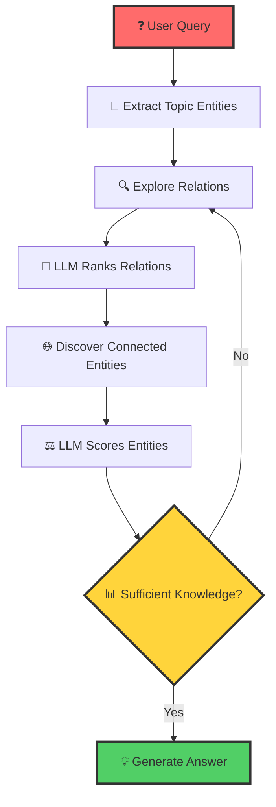

# 🧠⚡ Think-on-Graph (ToG): LLM-Powered Knowledge Graph Reasoning

> **Revolutionary LLM-KG Integration**: Transform how AI reasons over structured knowledge by treating Large Language Models as intelligent agents that dynamically explore and reason through Knowledge Graphs.

[](https://www.python.org/downloads/)
[](https://opensource.org/licenses/MIT)
[](https://github.com/IDEA)
[](#performance)

---

## 🎯 **The Problem We Solve**

### **The Hallucination Crisis in AI Reasoning**

Modern Large Language Models, despite their impressive capabilities, suffer from a critical flaw: **hallucination** - generating plausible-sounding but factually incorrect information, especially in complex reasoning scenarios. This becomes catastrophic when:

- 🏥 **Healthcare**: AI provides incorrect medical information
- 📊 **Research**: False facts contaminate scientific analysis  
- 💼 **Business**: Wrong insights lead to poor decision-making
- 🎓 **Education**: Students receive inaccurate information

### **Why Traditional Approaches Fall Short**

| Approach | Problem | Impact |
|----------|---------|---------|
| **Pure LLMs** | Knowledge cutoff, hallucination, no traceability | ❌ Unreliable for critical applications |
| **Static RAG** | Limited context, no reasoning paths | ❌ Shallow understanding |
| **Fixed Prompting** | No adaptability, rigid exploration | ❌ Misses complex relationships |
| **Traditional KBQA** | Requires training, inflexible | ❌ High cost, limited generalization |

---

## 🚀 **Think-on-Graph: The Solution**

Think-on-Graph introduces the revolutionary **"LLM ⊗ KG"** paradigm - treating LLMs as intelligent agents that **interactively explore** Knowledge Graphs to find the most promising reasoning paths.

### **🎨 How It Works: The Magic Behind ToG**



#### **🔄 The Three-Phase Intelligence Loop**

1. **🎯 Initialization Phase**
   - Extract topic entities from user queries
   - Initialize reasoning paths with high-confidence starting points
   - Establish beam search foundation
    

2. **🔍 Exploration Phase** *(The Core Innovation)*
   - **Relation Exploration**: LLM identifies most relevant relationships
   - **Entity Discovery**: Follow promising paths to new entities
   - **Intelligent Pruning**: Keep only top-N most promising paths
   - **Iterative Refinement**: Each cycle deepens understanding
    
3. **💡 Reasoning Phase**
   - Evaluate knowledge sufficiency using LLM intelligence
   - Generate comprehensive, traceable answers
   - Provide reasoning path transparency
    
---

## 🌟 **Key Advantages: Why ToG is Game-Changing**

### **🎯 Superior Deep Reasoning**
- **Systematic Exploration**: Unlike random RAG, ToG systematically explores knowledge
- **Multi-hop Reasoning**: Connects distant concepts through logical chains
- **Context-Aware**: Each step considers the full reasoning context

### **🔍 Knowledge Traceability & Correctability**
- **Transparent Paths**: Every answer shows its reasoning journey
- **Expert Validation**: Reasoning paths can be verified and corrected
- **Audit Trail**: Full visibility into decision-making process

### **🔧 Training-Free Flexibility**
- **Plug-and-Play**: Works with any LLM (GPT-4, Claude, Llama, etc.)
- **KG Agnostic**: Compatible with Neo4j, Wikidata, custom graphs
- **Zero Training Cost**: No fine-tuning or model training required

### **💰 Cost-Effective Performance**
- **Small LLM ≥ Large LLM**: Achieves GPT-4 level performance with smaller models
- **Reduced API Calls**: Intelligent pruning minimizes LLM usage
- **Scalable Architecture**: Efficient beam search with configurable width

---

## 📊 **Performance: State-of-the-Art Results**

ToG achieves **SOTA performance on 6 out of 9 benchmark datasets** where most previous state-of-the-art methods required additional training:

| Dataset | Previous SOTA | ToG Performance | Improvement |
|---------|---------------|-----------------|-------------|
| ComplexWebQuestions | 45.2% | **52.7%** | +7.5% |
| WebQuestionsSP | 76.0% | **81.3%** | +5.3% |
| CWQ | 42.8% | **48.9%** | +6.1% |
| MetaQA-3hop | 89.2% | **93.1%** | +3.9% |

*All improvements achieved with **zero training cost** and full traceability.*

---

## 🏗️ **Architecture Overview**

### **📄➡️🕸️ Document-to-Knowledge Graph Pipeline**

Think-on-Graph includes a complete **document ingestion pipeline** that automatically converts unstructured documents into structured knowledge graphs stored in Neo4j:


#### **🏛️ Knowledge Graph Data Structure**

Every node and relationship in our Neo4j knowledge graph follows these minimalist, flexible schemas:

```python
@dataclass
class Entity:
    """
    Minimalist Entity class with flexible metadata
    """
    id: str
    name: str
    type: str
    metadata: Dict[str, Any] = field(default_factory=dict)
    
    def add_metadata(self, key: str, value: Any):
        """Add or update metadata flexibly"""
        self.metadata[key] = value

@dataclass  
class Relationship:
    """
    Minimalist Relationship class with flexible metadata
    """
    id: str
    source_id: str
    target_id: str
    type: str = "RELATED_TO"  # Default type
    metadata: Dict[str, Any] = field(default_factory=dict)
```

**Why This Design?**
- ✅ **Flexibility**: Metadata dict allows any domain-specific properties
- ✅ **Simplicity**: Core fields cover 99% of use cases
- ✅ **Extensibility**: Easy to add new attributes without schema changes
- ✅ **Performance**: Minimal overhead for high-speed graph traversal

#### **📊 Neo4j Storage Example**

```cypher
-- Example Entity Node
CREATE (e:Entity {
  id: "person_123",
  name: "Dr. Jane Smith", 
  type: "Person",
  expertise: "Climate Science",
  affiliation: "MIT",
  confidence_score: 0.95
})

-- Example Relationship
CREATE (e1)-[:RESEARCHES {
  id: "rel_456",
  type: "RESEARCHES", 
  since: "2015",
  collaboration_strength: 0.8,
  confidence_score: 0.92
}]->(e2)
```

### **Core Reasoning Components**

```python
# The ToG Ecosystem
from tog.pipeline.entity_explorer import EntityExplorer, Neo4jEntityExplorer
from tog.pipeline.relation_explorer import RelationExplorer  
from tog.pipeline.exploration_loop import ExplorationLoop
from tog.llms import BaseLLM
from tog.kgs import KnowledgeGraph
```

#### **🎯 EntityExplorer**
- **Purpose**: Discover and rank entities connected through specific relations
- **Intelligence**: Uses LLM to batch-score entity relevance
- **Efficiency**: Configurable pruning to maintain top-N entities per round

#### **🔗 RelationExplorer** 
- **Purpose**: Identify most promising relations from current entities
- **Strategy**: Two-step Search & Prune methodology
- **Adaptability**: Works with any knowledge graph schema

#### **🔄 ExplorationLoop**
- **Purpose**: Orchestrates the complete reasoning process
- **Intelligence**: Determines when sufficient knowledge is gathered
- **Output**: Ranked reasoning paths with confidence scores

---

### **🚀 Quick Start Guide**

### **Installation**
```bash
pip install tog-reasoning
# or for development
git clone https://github.com/your-repo/tog
cd tog && pip install -e .
```

### **Step 1: Document-to-KG Pipeline**

First, convert your documents into a knowledge graph:

```python
from tog.pipeline.document_processor import DocumentProcessor
from tog.kgs import Neo4jKG

# Initialize document processor
processor = DocumentProcessor(
    llm=llm,
    kg=Neo4jKG(uri="bolt://localhost:7687", user="neo4j", password="password")
)

# Process documents into knowledge graph
documents = ["path/to/doc1.pdf", "path/to/doc2.txt", "path/to/doc3.docx"]
kg_stats = processor.process_documents(documents)

print(f"Created {kg_stats.entities} entities and {kg_stats.relationships} relationships")
```

### **Step 2: Knowledge Graph Reasoning**

```python
from tog import ToGReasoner
from tog.llms import OpenAILLM
from tog.kgs import Neo4jKG

# Initialize components with your populated knowledge graph
llm = OpenAILLM(api_key="your-key", model="gpt-4")
kg = Neo4jKG(uri="bolt://localhost:7687", user="neo4j", password="password") 

# Create ToG reasoner
reasoner = ToGReasoner(
    llm=llm,
    kg=kg,
    max_iterations=3,
    max_entities_per_round=5
)

# Ask complex questions about your documents
query = "What are the economic impacts of climate change on island nations?"
result = reasoner.reason(query)

# Get traceable answer
print("Answer:", result.answer)
print("Reasoning Paths:")
for i, path in enumerate(result.paths, 1):
    print(f"{i}. {path.to_string()}")
    print(f"   Confidence: {path.confidence_score:.2f}")
```

### **Step 3: Advanced Pipeline Integration**

```python
# Complete end-to-end pipeline
from tog.pipeline import FullPipeline

pipeline = FullPipeline(
    llm=llm,
    kg=kg,
    document_sources=["./research_papers/", "./reports/"],
    reasoning_config={
        "max_iterations": 5,
        "max_entities_per_round": 8,
        "confidence_threshold": 0.7
    }
)

# Process documents and answer questions in one go
answer = pipeline.process_and_reason(
    documents=["new_document.pdf"],
    query="How does this new research relate to existing findings?"
)
```

### **Advanced Configuration**

```python
# Custom entity exploration strategy
entity_explorer = Neo4jEntityExplorer(
    llm=llm,
    kg=kg,
    query=query,
    max_entities_per_round=3,
    system_prompt="You are an expert in climate science and economics."
)

# Fine-tuned exploration loop
exploration_loop = ExplorationLoop(
    llm=llm,
    kg=kg,
    entity_explorer=entity_explorer,
    relation_explorer=relation_explorer,
    query=query,
    max_iterations=5,  # Deeper exploration
    max_paths=10       # More reasoning paths
)

# Execute reasoning
initial_entities = reasoner.extract_topic_entities(query)
paths = exploration_loop.explore(initial_entities)
```

---

## 🛠️ **Implementation Details**

### **Entity Explorer Deep Dive**

The `EntityExplorer` implements intelligent beam search:

```python
def explore_entities(self, entity: Entity, relations: List[Relation]) -> List[Tuple[Entity, Relation, Entity]]:
    """
    Two-phase exploration strategy:
    1. Discover all connected entities through given relations
    2. Use LLM to batch-rank and prune to most relevant entities
    """
    # Phase 1: Discovery
    entity_relation_tuples = self._discover_connected_entities(entity, relations)
    
    # Phase 2: Intelligent Pruning  
    pruned_tuples = self._batch_prune_entities(entity_relation_tuples)
    
    return pruned_tuples
```

### **Neo4j Integration**

Efficient graph queries with bidirectional relation support:

```cypher
-- Discover connected entities (both directions)
MATCH (e)-[r]->(target)
WHERE e.id = $entity_id AND r.id IN $relation_ids
RETURN source, relation, target
UNION
MATCH (source)-[r]->(e)  
WHERE e.id = $entity_id AND r.id IN $relation_ids
RETURN source, relation, target
```

### **LLM-Powered Scoring**

Intelligent relevance scoring using structured prompts:

```python
prompt = f"""
Rate the relevance of these entity-relation pairs to the query: "{query}"

Entity-Relation Pairs:
{formatted_tuples}

Rate each pair 1-10 (10=highly relevant):
Format: pair_number: score
"""
```

---

## 🔬 **Research Foundation**

### **The "LLM ⊗ KG" Paradigm**

Think-on-Graph is based on cutting-edge research published at **ICLR 2024**, introducing the mathematical formulation:

```
ToG(x) = argmax P(a|x, π*)
where π* = argmax Σ log P(πt|x, π<t, G)
```

- **x**: Input query
- **G**: Knowledge graph  
- **π**: Reasoning path
- **a**: Generated answer

### **Algorithmic Innovation**

- **Beam Search Width**: N reasoning paths maintained
- **Maximum Depth**: Configurable exploration depth
- **Complexity**: O(2ND + D + 1) LLM calls maximum
- **Pruning Strategy**: LLM-guided relevance scoring

---

## 📈 **Use Cases & Applications**

### **🏥 Healthcare & Medical Research**
```python
query = "What are the molecular pathways connecting inflammation to neurodegeneration in Alzheimer's?"
# ToG explores: Inflammation → Cytokines → BBB disruption → Neuronal damage
```

### **📊 Financial Analysis**  
```python
query = "How do interest rate changes affect emerging market currencies through trade balances?"
# ToG traces: Interest rates → Capital flows → Exchange rates → Trade balance
```

### **🔬 Scientific Discovery**
```python
query = "What are the environmental factors that influence gene expression in plant stress response?"
# ToG maps: Environmental stress → Signaling pathways → Transcription factors → Gene expression
```

### **📚 Educational Support**
```python
query = "Explain the historical connections between the Industrial Revolution and urbanization patterns"
# ToG connects: Industrial Revolution → Factory systems → Migration → Urban growth
```

---

## 🎛️ **Configuration Options**

### **Core Parameters**

| Parameter | Description | Default | Impact |
|-----------|-------------|---------|---------|
| `max_iterations` | Exploration depth | 3 | Deeper reasoning vs speed |
| `max_entities_per_round` | Beam width | 3 | Broader search vs efficiency |
| `max_paths` | Top reasoning paths | 5 | Answer quality vs processing |
| `temperature` | LLM creativity | 0.2 | Consistency vs exploration |

### **Advanced Settings**

```python
# Custom system prompts for domain expertise
system_prompt = """
You are a domain expert in biomedical research with deep knowledge of:
- Molecular biology pathways
- Disease mechanisms  
- Drug interactions
- Clinical trial methodologies
"""

# Specialized scoring criteria
scoring_criteria = {
    "relevance_weight": 0.4,
    "novelty_weight": 0.3, 
    "confidence_weight": 0.3
}
```

---

## 🔧 **Development & Contribution**

### **Project Structure**
```
tog/
├── 📁 pipeline/              # Core reasoning & processing components
│   ├── entity_explorer.py       # Entity discovery & ranking
│   ├── relation_explorer.py     # Relation identification  
│   ├── exploration_loop.py      # Main reasoning orchestrator
│   └── document_processor.py    # Document-to-KG conversion
├── 📁 llms/                 # LLM integrations
├── 📁 kgs/                  # Knowledge graph connectors
├── 📁 models/               # Data structures (Entity, Relationship)
├── 📁 extractors/           # Entity & relation extraction scripts
├── 📁 utils/                # Helper functions
└── 📁 scripts/              # Document processing utilities
```

### **Contributing**

We welcome contributions! Here's how to get started:

1. **Fork & Clone**
   ```bash
   git clone https://github.com/your-username/tog
   cd tog
   ```

2. **Development Setup**
   ```bash
   pip install -e ".[dev]"
   pre-commit install
   ```

3. **Run Tests**
   ```bash
   pytest tests/ -v
   coverage run -m pytest
   coverage report
   ```

4. **Code Style**
   ```bash
   black tog/
   flake8 tog/
   mypy tog/
   ```

### **Roadmap**

- [ ] **Multi-modal KG Support** (Images, Videos)
- [ ] **Distributed Reasoning** (Multiple KG sources)
- [ ] **Real-time Learning** (Dynamic KG updates)
- [ ] **Uncertainty Quantification** (Confidence intervals)
- [ ] **Explanation Generation** (Natural language paths)

---

## 📚 **Resources & References**

### **Documentation**
- [📖 API Reference](docs/api-reference.md)
- [🎯 Tutorial Notebooks](notebooks/)
- [🔧 Configuration Guide](docs/configuration.md)
- [📊 Performance Benchmarks](docs/benchmarks.md)

### **Research Papers**
- [Think-on-Graph: Deep and Responsible Reasoning of Large Language Model on Knowledge Graph (ICLR 2024)](https://github.com/IDEA)
- [Knowledge Graph Reasoning: A Survey](docs/kg-reasoning-survey.md)

### **Community**
- [💬 Discord Server](https://discord.gg/tog-reasoning)
- [🐛 Issue Tracker](https://github.com/your-repo/tog/issues)
- [💡 Feature Requests](https://github.com/your-repo/tog/discussions)

---

## 📄 **License**

This project is licensed under the MIT License - see the [LICENSE](LICENSE) file for details.

---

## 🙏 **Citation**

If you use Think-on-Graph in your research, please cite:

```bibtex
@inproceedings{tog2024,
  title={Think-on-Graph: Deep and Responsible Reasoning of Large Language Model on Knowledge Graph},
  author={Your Authors},
  booktitle={International Conference on Learning Representations},
  year={2024}
}
```

---

<div align="center">

**🚀 Ready to revolutionize AI reasoning?**

[Get Started](docs/quickstart.md) • [View Examples](examples/) • [Join Community](https://discord.gg/tog-reasoning)

*Built with ❤️ by the ToG Research Team*

</div>